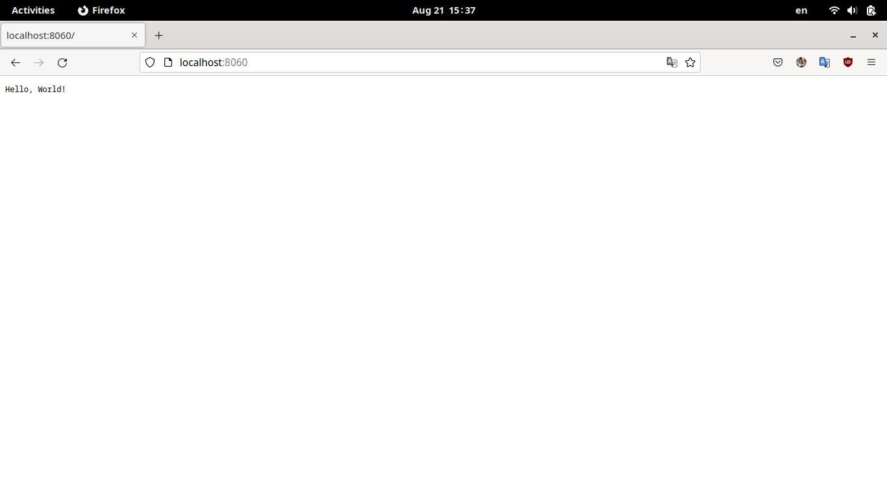

# Dockerfile hello_world

### Optimize Dockerfile (make it more lightweight)

The obvious first step is to use a lightweight base image. In particular, we can base our image on `golang:alpine` rather than `golang`. That alone cuts the image size from ~1GB to ~350MB.

Since our application is a compiled one, we can optimize futhermore by leveraging a multi stage build where only the compiled binary makes it to the final image.

### Do multistage build

We can build the Go application in `golang:alpine` and copy the generated executable into a new `alpine` base image. This further reduces our generated image size from ~350MB to ~12MB.

Note that once we utilize this optimization, using `golang:alpine` instead of `golang` in the first layer is no longer relevant from the end user's point of view. Still, that opitmization matters from the image builder's point of view so we kept it.

We further optimized the resulting image by maipulating Go compiler flags. In particular, we can reduce the final image size from ~12MB to ~10MB by stripping debugging symbols from the generated binary.

Finally, by generating a statically-linked binary we no longer depend on `alpine` shared libraries; we can instead use an empty `scratch` image as a base instead. This final optimization further reduced the final image size from ~10MB to 4.46MB. Neat!

We can think of two more possible optimizations:
* Experiment with compiling against `musl` rather than `glibc`.
* Use an executable packer such as `upx`.

However, this is somewhat obsessive at this point so let's stop here :)

### Build, run and open in browser

One last modification we made to the Dockerfile before building was to set the container user to `nobody` for security concerns.

Then we built the image with
``` bash
$ docker build --tag khaledismaeel/schwarzthaltech-interview-devops --tag khaledismaeel/schwarzthaltech-interview-devops:v1.0.0 .
```

We run the image with
``` bash
docker run --cap-drop ALL --publish 8060:8060 khaledismaeel/schwarzthaltech-interview-devops
```
Note how we drop all container capabilities, principle of least privilege.



### Tag it with :v1.0.0 and :latest and push the image to your DockerHub or Github Packages repository

The repository can be found [here](https://hub.docker.com/repository/docker/khaledismaeel/schwarzthaltech-interview-devops).
