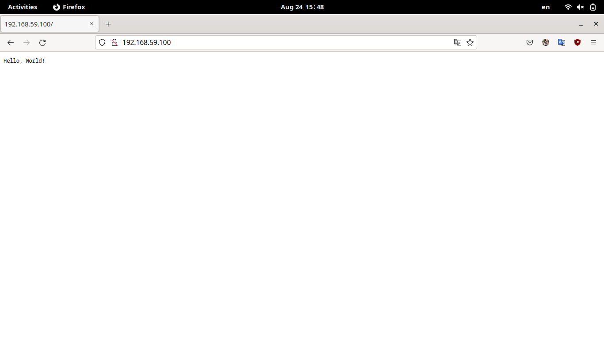
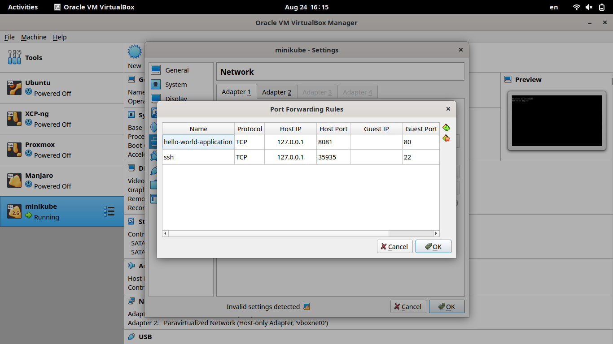
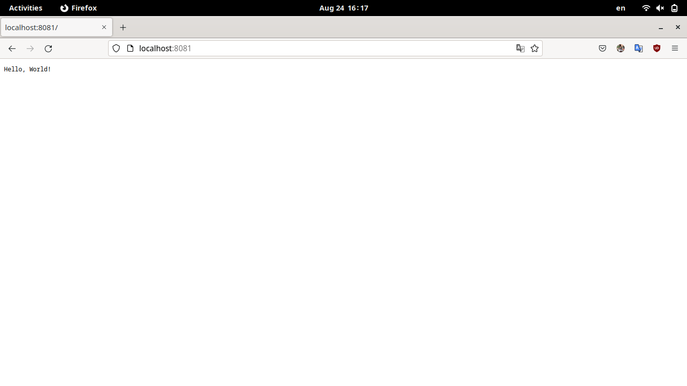

# Deploy hello_world to kubernetes

### Run local kubernetes cluster

We decided to go with Minikube rather than k3d given our familiarity with it. The equivalent of the k3d configuration provided was later configured manually.

Besides the obvious `minikube`, `kubectl`, and `helm` packages, we also installed Lens and the Kubernetes Visual Studo Code extension for convenience.

### Complete the helm chart, use your hello_world:v1.0.0 image

The chart specifies 3 Kubernetes resources:
* Deployment. This resource specifies the desired state of the pods responsible for running our `hello-world` application images. It specifies traits such as the application image, the number of replicas, the criteria for liveness and readiness, and some metadata used to idenify the deployment.
* Service. This resource provides a static addressing scheme on top of the dynamic pod IP addresses. It specifies rules for accessing pods tagged with `app: hello-world` with a port forwarding rule.
* Ingress. An abstraction of a load balancer with fine-grained routing rules. In our particular case it's quite simple and just forwards outside traffic to the internal service.

### Install the helm chart in `hello` namespace

First we create the namespace.

```
$ kubectl create namespace hello
```

Then we install the Helm chart.

```
# optionally lint the chart
$ helm lint helm/hello-world
# install
$ helm --namespace hello upgrade --install test helm/hello-world
```

And that's it! We can now check the deployed resources.

```
$ kubectl --namespace hello get all
NAME                                          READY   STATUS    RESTARTS   AGE
pod/hello-world-deployment-6cbbff488f-lsnpc   1/1     Running   0          109m
pod/hello-world-deployment-6cbbff488f-tt2pz   1/1     Running   0          109m
pod/hello-world-deployment-6cbbff488f-z2hsk   1/1     Running   0          109m

NAME                          TYPE        CLUSTER-IP     EXTERNAL-IP   PORT(S)   AGE
service/hello-world-service   ClusterIP   10.96.56.155   <none>        80/TCP    109m

NAME                                     READY   UP-TO-DATE   AVAILABLE   AGE
deployment.apps/hello-world-deployment   3/3     3            3           109m

NAME                                                DESIRED   CURRENT   READY   AGE
replicaset.apps/hello-world-deployment-6cbbff488f   3         3         3       109m
```

The ingress is not above though, it's not printed by default.

```
$ kubectl --namespace hello get ingress
NAME                  CLASS   HOSTS   ADDRESS          PORTS   AGE
hello-world-ingress   nginx   *       192.168.59.100   80      108m
```

### You must be able to access http://localhost:8081 and get "Hello, World!"

The networking flow of Minikube is slightly different than that of K3d. First we need to enable the ingress addon to expose our ingress.

```
$ minikube addons enable ingress
```

At this point the application is available at `<minikube-ip>:80`, where `<minikube-ip>` is the IP address of the virtual machine (running in VirtualBox) in which the cluster is running. We can get this IP as follows.

```
$ minikube ip
192.168.59.100
```

So we can see it in the browser.



In order to access the application on `localhost:8081` we can do one of several configurations. We went with the simplest one there is: configure a forwarding rule in VirtualBox as shown.



Now we can access the application on `localhost:8081`!



An alternative approach would be configure this forwarding rule with `minikube` or even on the operating system level with `iptables`.

### Don't forget to delete the cluster

```
$ minikube delete
```

Done!
