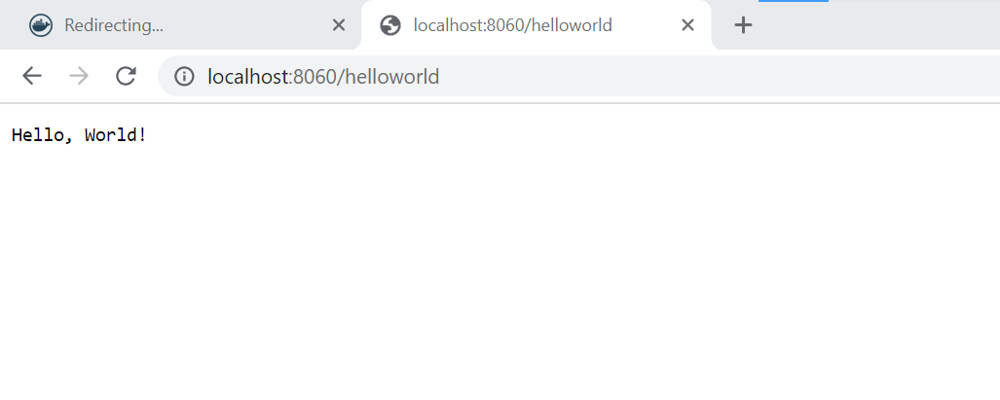

# Task 1 - Dockerfile hello_world

### 1. Optimize Dockerfile (make it more lightweight)
```
To optimize it, it means I have to make the Dockerfile as lightweight
as possible and the benefits to this is to reduce the attack area and
improve the security of the overall application. The methods implemented involves:

- Using a specific base image that matches the requirements of the 
application in production

- when using the COPY command, I made sure I copied the necessary files 
for the building and running of the application

- Combining the RUN command instead of using multiple RUN commands, 
becasue these commands add an extra layer to the application

- Finally using a multi-stage build

```

### 2. Do a multistage build
```
Type here what was done...

To create a multistage build technically mean creating a more than one 
build so as to keep the Dockerfile optimized, easy to read and maintain.
This is so because most times developers uses different Dockerfile for 
build and production. To achieve this this is what i did:
The multistage build consist of two stages, where each is defined with
its own FROM statement

- Build Stage 

In this stage, I use an official Golang image as the base image and 
give it an alias "build" ('FROM golang:1.19 AS build). 
I set the  working directory to "./app", copy the go.mod files to 
the container, and download the Go module dependencies using the "go 
mod download". 
I then copy the rest of the application code to the container and build 
it using the "CGO_ENABLED=0 GOOS=linux go build" command with the 
necessary flags to produce a statically linked binary executable ('/
hello_world').
Finally an optional case of using the strip command. The strip command
can be used to remove the debug information from the executable, this 
like i said is optional and not necessary.

- Production Stage

In this stage, I will start with a minimal 'scratch' base image, which
contains no files or dependencies.
I copied the '/hello_world' binary executable from the 'build' stage
using the 'COPY --from=build' command which copies the file from the 
'build' stage to the current stage.
Finally, I will set the entry point to '/hello_world', which specifies
the command to run when the container starts
```

### 3. Build, run and open in browser
```
To do this we will run the following command

- docker build -t go_app .
- docker run -p 8060:8060 go_app

To open in browser, I will access http:/localhost:8060/helloworld

```
<center>

{ =600x}
</center>

### 4. Tag it with :v1.0.0 and :latest and push the image to your DockerHub or Github Packages repository
```
For (:v1.0.0):
- docker build -t galactican/go_app:v1.0.0 .
- docker push galactican/go_app:v1.0.0

```
[Docker image for v1.0.0](https://hub.docker.com/layers/galactican/go_app/v1.0.0/images/sha256:4805a5a50105f82ec9563b118757084608a565760e64281bac93f8c3370882cd)

```
For (:latest)
- docker build -t galactican/go_app:latest .
- docker push galactican/go_app:latest

```
[Docker image for :latest](https://hub.docker.com/layers/galactican/go_app/latest/images/sha256:4805a5a50105f82ec9563b118757084608a565760e64281bac93f8c3370882cd)


